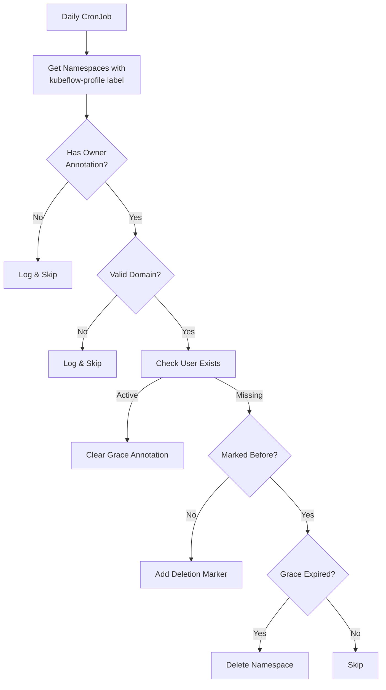

# Namespace Auditor

Automated Kubernetes namespace cleaner for Kubeflow profiles with configurable grace periods and domain validation.



## Key Features

- Daily Maintenance: Runs at midnight UTC
- Domain Validation: Configurable allowed email domains
- Grace Period: 30-day buffer before deletion (configurable)
- Safety Mechanisms: Dry-run mode, audit logging
- Kubernetes Native: RBAC-enabled service account

## Configuration

### Configuration Files

1. configmap.yaml - Application settings:

``` bash
# Location: deploy/configmap.yaml
data:
  allowed-domains: "company.com, example.org"  # Comma and space-separated list
  grace-period: "720h"                         # 30 days in duration format
```

2. secret.yaml - Azure AD credentials:

``` bash
# Location: deploy/secret.yaml
stringData:
  tenant-id: <AZURE_TENANT_ID>         # Azure directory ID
  client-id: <AZURE_CLIENT_ID>         # Application ID
  client-secret: <AZURE_CLIENT_SECRET> # Client secret value
```

## Deployment

### Cluster Setup

``` bash
kubectl apply -f deploy/configmap.yaml  # Domain rules
kubectl apply -f deploy/secret.yaml     # Azure credentials
kubectl apply -f deploy/rbac.yaml
kubectl apply -f deploy/cronjob.yaml
```

### Azure Credentials

#### Production Cluster:

- Stored in Kubernetes Secrets via secret.yaml
- Automatically mounted by CronJob

#### Local Development:

``` bash
export AZURE_TENANT_ID=<value-from-secret.yaml>
export AZURE_CLIENT_ID=<value-from-secret.yaml>
export AZURE_CLIENT_SECRET=<value-from-secret.yaml>
```

## Operations

``` bash
# Enable dry-run mode
kubectl set env cronjob/namespace-auditor DRY_RUN="true"

# Check execution status
kubectl get cronjob namespace-auditor -o jsonpath="{.status.lastScheduleTime}"

# Inspect namespace annotations
kubectl get namespaces -o custom-columns=NAME:.metadata.name,ANNOTATIONS:.metadata.annotations

# View recent logs
kubectl logs -l app=namespace-auditor --tail=100
```

## Security

- 🔒 Secrets managed through Kubernetes Secrets (use SealedSecrets in production)
- 🔐 Minimal RBAC permissions with dedicated service account
- 🔍 All operations audited and logged
- 🛡️ Network policies restrict internal cluster access only

## Monitoring & Validation

``` bash
# Verify ConfigMap values
kubectl get configmap namespace-auditor-config -o yaml

# Inspect secret metadata
kubectl describe secret azure-creds

# Check job history
kubectl get jobs -l app=namespace-auditor

# Investigate failures
kubectl describe cronjob namespace-auditor
kubectl get events --sort-by=.metadata.creationTimestamp
```

## Testing

### Local Testing (no Azure):

``` bash
make test-local  # Uses testdata/config.yaml and testdata/namespaces.yaml
```

### Cluster Dry Run:

``` bash
kubectl set env cronjob/namespace-auditor DRY_RUN="true"
```

### Azure Integration:

``` bash
AZURE_INTEGRATION=1 make test-integration
```

## Maintenance

- 🔄 Rotate secret.yaml credentials quarterly
- 📆 Review allowed-domains when adding new email domains
- 📊 Monitor cronjob execution logs regularly
- ⚠️ Update grace-period in configmap.yaml as organizational policies change
