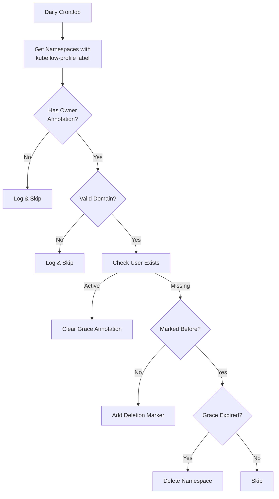

# Namespace Auditor

Automated Kubernetes namespace cleaner for Kubeflow profiles with configurable grace periods and domain validation.



## Key Features

- Daily Maintenance: Runs at midnight UTC
- Domain Validation: Configurable allowed email domains
- Grace Period: 90-day buffer before deletion (configurable)
- Safety Mechanisms: Dry-run mode, audit logging
- Kubernetes Native: RBAC-enabled service account

## Deployment

``` bash
# Build and push image
make docker-build docker-push

# Apply Kubernetes manifests
kubectl apply -f deploy/configmap.yaml
kubectl apply -f deploy/secret.yaml
kubectl apply -f deploy/rbac.yaml
kubectl apply -f deploy/cronjob.yaml
```

## Configuration

``` bash
# configmap.yaml
allowed-domains: "statcan.gc.ca,cloud.statcan.ca"
grace-period: "2160h"  # 90 days

# secret.yaml
azure-creds:
  tenant-id: <AZURE_TENANT_ID>
  client-id: <AZURE_CLIENT_ID>
  client-secret: <AZURE_CLIENT_SECRET>x
```

## Operations

``` bash
# Dry-run test
kubectl set env cronjob/namespace-auditor DRY_RUN="true"

# Verify execution
kubectl get cronjob namespace-auditor -o jsonpath="{.status.lastScheduleTime}"

# Inspect annotations
kubectl get namespaces -o custom-columns=NAME:.metadata.name,ANNOTATIONS:.metadata.annotations

# View logs
kubectl logs -l app=namespace-auditor --tail=100
```

## Development

``` bash
# Run unit tests (non-Azure)
make test

# Run integration tests (requires Azure creds)
AZURE_INTEGRATION=1 make test-integration

# Local validation with test data
make test-local  # Uses testdata/ configs
```

## Security

- RBAC: Minimal cluster role permissions
- Secrets: Encrypted storage in production
- Auditing: All operations logged
- Network Policy: Cluster-internal access only

## Monitoring

``` bash
# Check job history
kubectl get jobs -l app=namespace-auditor

# Verify service account access
kubectl auth can-i delete namespaces \
  --as=system:serviceaccount:default:namespace-auditor

# Investigate failures
kubectl describe cronjob namespace-auditor
kubectl get events --sort-by=.metadata.creationTimestamp
```
