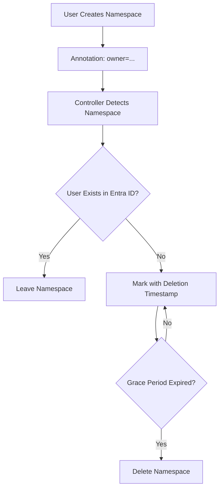
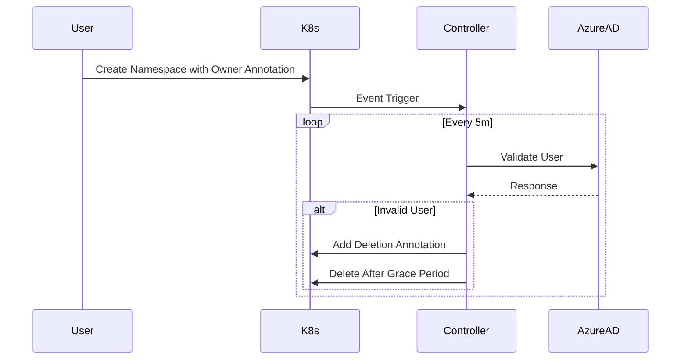
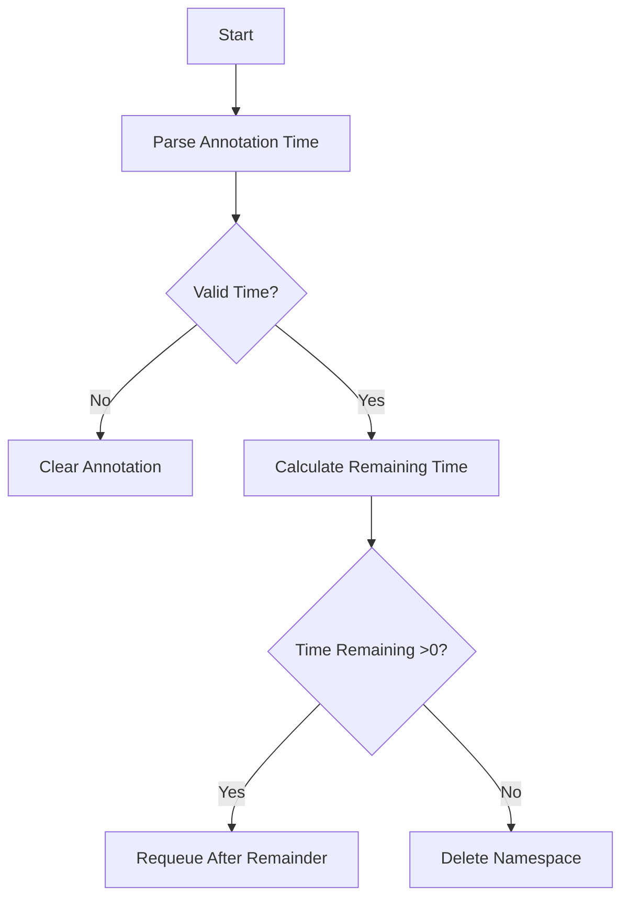
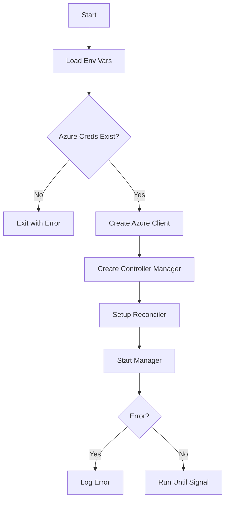
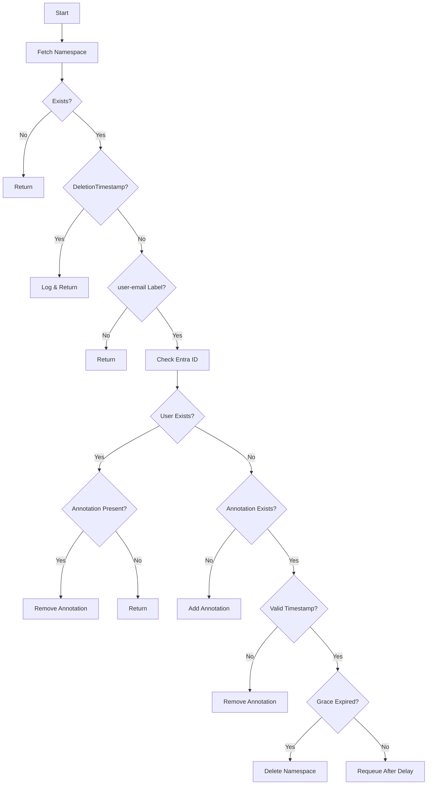
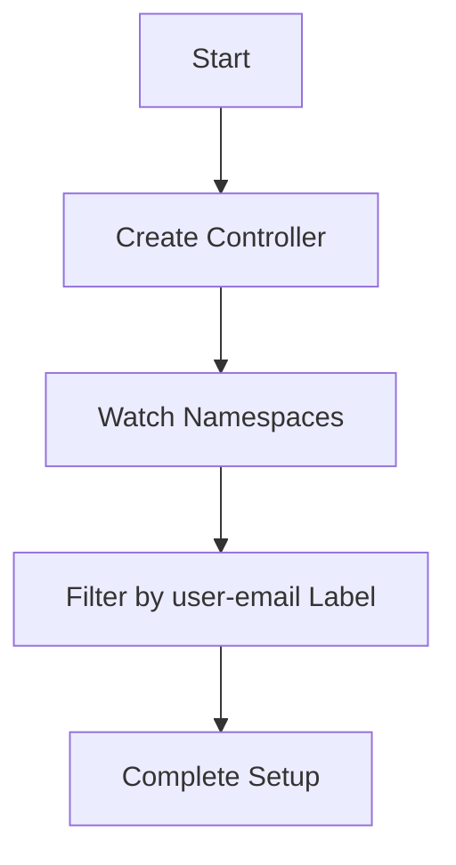
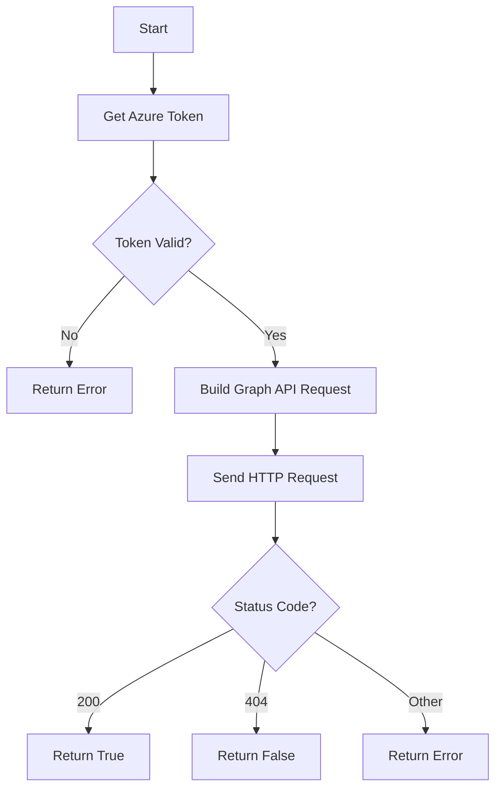

# Namespace Auditor Controller

A Kubernetes controller for **Statistics Canada** that automatically cleans up Kubeflow namespaces when their associated Entra ID (Azure AD) user accounts no longer exist.

## Features
- **Automated Validation:** Checks user existence via Microsoft Graph API.
- **Grace Period:** Configurable safety window before deletion (default: 48h).
- **Audit Trail:** Annotations track deletion lifecycle.
- **Cluster Native:** Built with controller-runtime.



## Installation

### 1. Clone & Build
```bash
git clone https://github.com/bryanpaget/namespace-auditor.git
cd namespace-auditor
docker build -t bryanpaget/namespace-auditor:latest .
docker push bryanpaget/namespace-auditor:latest
```

### 2. Azure Credentials
```bash
kubectl create secret generic azure-creds \
  --from-literal=tenantId=<YOUR_TENANT> \
  --from-literal=clientId=<CLIENT_ID> \
  --from-literal=clientSecret=<CLIENT_SECRET>
```

### 3. Deploy
```bash
kubectl apply -f config/rbac/role.yaml
kubectl apply -f config/manager/deployment.yaml
```

## Configuration

| Environment Variable | Description               | Default |
|----------------------|---------------------------|---------|
| `AZURE_TENANT_ID`    | Azure AD Tenant ID        | Required|
| `AZURE_CLIENT_ID`    | Application Client ID     | Required|
| `AZURE_CLIENT_SECRET`| Client Secret             | Required|
| `GRACE_PERIOD`       | Deletion delay duration   | `48h`   |

## Namespace Requirements
```yaml
apiVersion: v1
kind: Namespace
metadata:
  name: user-namespace
  annotations:
    owner: "user.name@statcan.gc.ca"  # or user.name@cloud.statcan.ca
```

## Verification

**Check Annotations:**
```bash
kubectl get namespace <NAME> -o jsonpath='{.metadata.annotations}'
```

**Monitor Deletions:**
```bash
kubectl get namespaces -w -o jsonpath='{range .items[*]}{.metadata.name}{"\t"}{.metadata.annotations.owner}{"\n"}{end}'
```

**View Logs:**
```bash
kubectl logs -l app=namespace-auditor --tail=50 -f
```

## Architecture Flow


## Troubleshooting

**Common Errors:**
- `CreateContainerConfigError`: Missing/misconfigured Azure secret
- `Forbidden`: RBAC permissions mismatch
- `ImagePullBackOff`: Incorrect image name/tag

**Debug Commands:**
```bash
kubectl describe pod <AUDITOR_POD>
kubectl get events --sort-by=.metadata.creationTimestamp
kubectl auth can-i delete namespaces --as=system:serviceaccount:default:namespace-auditor
```

## Security

- Rotate Azure credentials quarterly
- Limit controller permissions using RBAC
- Enable Kubernetes audit logging
- Consider namespace isolation for production
- Annotation Validation: Only processes @statcan.gc.ca and @cloud.statcan.ca domains

## Diagrams

### Grace Period Calculation Flow



### main() Function Flow



### Reconcile() Function Detailed Flow



### SetupWithManager() Flow



### UserExists() Flow (Azure Check)




