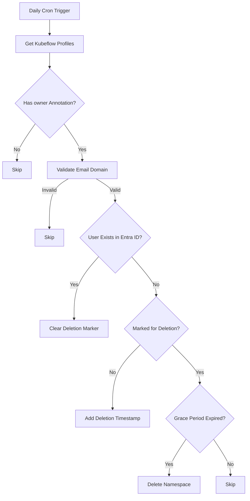

# Namespace Auditor CronJob

A scheduled cleaner for Kubeflow profiles that removes namespaces belonging to invalid StatCan users after a 90-day grace period.



## Key Features
- Runs daily at midnight
- Processes only Kubeflow profile namespaces
- 90-day safety window before deletion
- Automatic cleanup of invalid @statcan.gc.ca/@cloud.statcan.ca accounts
- Comprehensive test suite
- Dry-run mode for safe testing

## Configuration
```yaml
# ConfigMap
grace-period: "2160h"  # 90 days
allowed-domains: "statcan.gc.ca,cloud.statcan.ca"

# Secret
azure-creds:
  tenant-id: <ENTRA_ID>
  client-id: <APP_ID>
  client-secret: <SECRET>
```

## Deployment
```bash
# First-time setup
make docker-build docker-push
kubectl apply -f config/serviceaccount.yaml
kubectl apply -f config/rbac.yaml

# Regular updates
kubectl apply -f config/configmap.yaml
kubectl apply -f config/secret.yaml
kubectl apply -f config/cronjob.yaml

# Full deployment
make deploy
```

## Testing
### Unit Tests
```bash
make test-unit
```
Validates core logic including email validation and duration parsing

### Integration Tests
```bash
make test-integration
```
Tests Kubernetes API interactions using fake client

### Local Testing
```bash
# Test with local files
make test-local

# Example test data structure
testdata/
├── config.yaml         # Test configuration
└── namespaces.yaml     # Sample test namespaces
```

## Verification
```bash
# Check execution status
kubectl get cronjob namespace-auditor -o jsonpath='{.status.lastScheduleTime}'

# View audit markers
kubectl get ns -o jsonpath='{range .items[*]}{.metadata.name}{"\t"}{.metadata.annotations}{"\n"}{end}'

# View logs
kubectl logs -l app=namespace-auditor --tail=50
```

## Security
- Least-privilege RBAC permissions
- Secret management best practices
- Regular security scans in CI/CD
- Audit logging for all operations

## Troubleshooting
```bash
# Check pod status
kubectl get pods -l app=namespace-auditor

# View events
kubectl get events --sort-by=.metadata.creationTimestamp

# Verify permissions
kubectl auth can-i delete namespaces --as=system:serviceaccount:default:namespace-auditor
```
