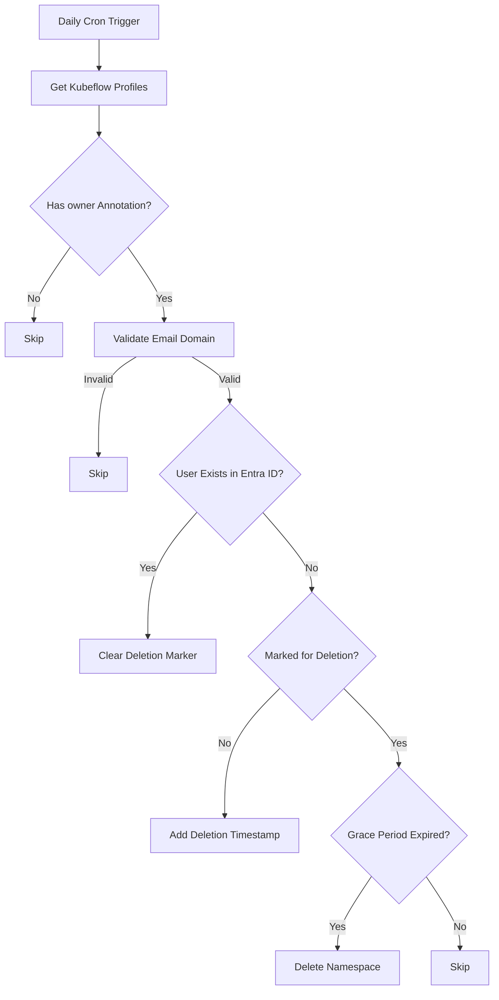

# Namespace Auditor CronJob

A scheduled cleaner for Kubeflow profiles that removes namespaces belonging to invalid StatCan users after a 90-day grace period.



### Key Features

- Runs daily at midnight
- Processes only Kubeflow profile namespaces
- 90-day grace period before deletion
- Automatic cleanup of invalid @statcan.gc.ca/@cloud.statcan.ca accounts

### Configuration

``` yaml
# ConfigMap
grace-period: "2160h"  # 90 days
allowed-domains: "statcan.gc.ca,cloud.statcan.ca"

# Secret
azure-creds:
  tenant-id: <ENTRA_ID>
  client-id: <APP_ID>
  client-secret: <SECRET>
```

### Deployment

``` bash
kubectl apply -f config/configmap.yaml
kubectl apply -f config/secret.yaml
kubectl apply -f cronjob.yaml
```

### Verification

 ``` bash
# Check last execution
kubectl get cronjob namespace-auditor -o jsonpath='{.status.lastScheduleTime}'

# View audit markers
kubectl get ns -o jsonpath='{range .items[*]}{.metadata.name}{"\t"}{.metadata.annotations}{"\n"}{end}'
```
